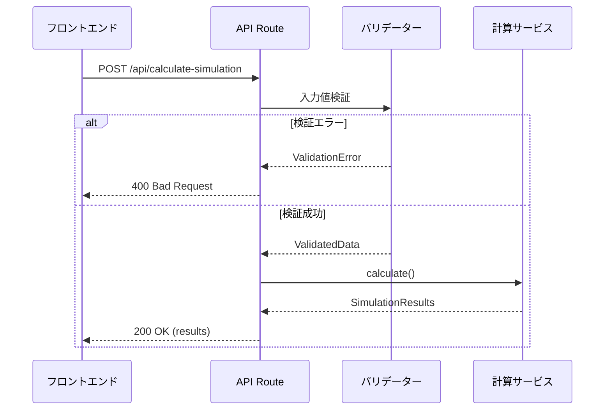

# 設計ファイル: バックエンド計算処理API実装

## 1. アーキテクチャ設計

### 1.1 全体構成
```
app/
├── api/
│   └── calculate-simulation/
│       └── route.ts        # API Route ハンドラー
├── lib/
│   ├── types/
│   │   └── simulation.ts   # 型定義
│   ├── validators/
│   │   └── simulation.ts   # バリデーション
│   └── services/
│       └── simulation-calculator.ts  # 計算ロジック
└── app/
    └── page.tsx           # 既存のフロントエンド（修正）
```

### 1.2 レイヤー構成
1. **APIレイヤー** (`app/api/calculate-simulation/route.ts`)
   - HTTPリクエスト/レスポンスのハンドリング
   - エラーハンドリング
   - CORSヘッダー設定

2. **バリデーションレイヤー** (`lib/validators/simulation.ts`)
   - 入力値の検証
   - 型ガード関数

3. **ビジネスロジックレイヤー** (`lib/services/simulation-calculator.ts`)
   - 投資計算ロジック
   - 結果の生成

4. **型定義レイヤー** (`lib/types/simulation.ts`)
   - リクエスト/レスポンスの型定義
   - 共通インターフェイス

## 2. データフロー設計



## 3. 詳細設計

### 3.1 型定義

```typescript
// lib/types/simulation.ts

export interface SimulationRequest {
  principal: number
  interestType: 'compound' | 'simple'
  annualRate: number
  years: number
  depositAmount: number
  depositFrequency: 'none' | 'monthly' | 'yearly'
  taxRate: number
  taxTiming: 'annual' | 'maturity'
  managementFee: number
  tradingFee: number
}

export interface SimulationResult {
  year: number
  principal: number
  deposit: number
  interest: number
  tax: number
  fee: number
  balance: number
}

export interface SimulationResponse {
  success: boolean
  data?: SimulationResult[]
  error?: string
}
```

### 3.2 API Route設計

```typescript
// app/api/calculate-simulation/route.ts

export async function POST(request: Request) {
  try {
    const body = await request.json()
    
    // バリデーション
    const validationResult = validateSimulationRequest(body)
    if (!validationResult.success) {
      return Response.json(
        { success: false, error: validationResult.error },
        { status: 400 }
      )
    }
    
    // 計算実行
    const results = calculateSimulation(validationResult.data)
    
    return Response.json(
      { success: true, data: results },
      { status: 200 }
    )
  } catch (error) {
    return Response.json(
      { success: false, error: 'サーバーエラーが発生しました' },
      { status: 500 }
    )
  }
}
```

### 3.3 バリデーション設計

```typescript
// lib/validators/simulation.ts

export function validateSimulationRequest(data: unknown) {
  // 必須フィールドチェック
  // 型チェック
  // 範囲チェック（0以上の数値など）
  // 戻り値: { success: boolean, data?: SimulationRequest, error?: string }
}
```

### 3.4 計算ロジック設計

```typescript
// lib/services/simulation-calculator.ts

export function calculateSimulation(params: SimulationRequest): SimulationResult[] {
  // 既存のフロントエンド計算ロジックをサーバー側に移植
  // 年次ループで計算
  // 複利/単利の処理
  // 税金・手数料計算
  // 結果配列を返す
}
```

## 4. フロントエンド修正設計

### 4.1 API呼び出しに変更

```typescript
// app/page.tsx

const calculateSimulation = async () => {
  setIsCalculating(true)
  
  try {
    const response = await fetch('/api/calculate-simulation', {
      method: 'POST',
      headers: { 'Content-Type': 'application/json' },
      body: JSON.stringify({
        principal,
        interestType,
        annualRate: annualRate[0],
        years: years[0],
        depositAmount,
        depositFrequency,
        taxRate,
        taxTiming,
        managementFee,
        tradingFee
      })
    })
    
    const result = await response.json()
    
    if (result.success) {
      setResults(result.data)
    } else {
      // エラー表示（Toast通知など）
      console.error(result.error)
    }
  } catch (error) {
    // ネットワークエラー処理
    console.error('通信エラーが発生しました')
  } finally {
    setIsCalculating(false)
  }
}
```

## 5. エラー処理設計

### 5.1 エラーレスポンス形式
```json
{
  "success": false,
  "error": "エラーメッセージ（日本語）"
}
```

### 5.2 エラー種別
- 400: 入力値エラー
  - 必須項目不足
  - 型不正
  - 範囲外の値
- 500: サーバーエラー
  - 予期しないエラー

## 6. テスト設計

### 6.1 単体テスト
- バリデーター関数のテスト
- 計算ロジックのテスト
- エッジケースのテスト

### 6.2 統合テスト
- APIエンドポイントのテスト
- エラーレスポンスのテスト

### 6.3 E2Eテスト
- フロントエンドからAPIへの連携テスト
- エラー時の画面表示テスト