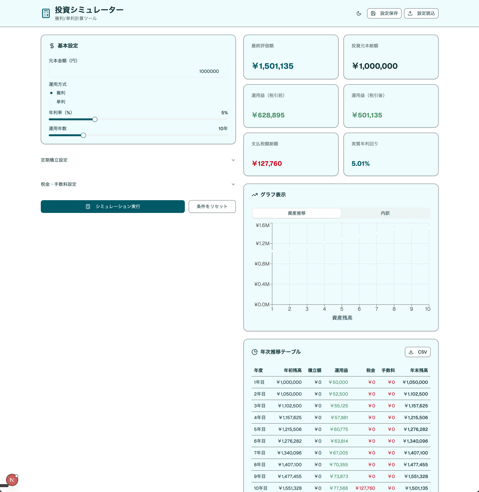

# 投資シミュレーター



## 環境構築

### 要件定義プロンプト

```
複利/単利シミュレーター（税・手数料込み）を作ります。
内容としては、元本・年率・年数・課税/手数料パラメータから最終価値、年次推移を表/簡易グラフ描画できるようにしたいです。データベースを使いたくないので設定等はローカルストレージに保存してください。
処理計算はバックエンド側で処理したいので、フロントエンドは描画に集中させるような要件としてください。このようなアプリケーションを作成するために必要な要件を定義してください。
```

### モック作成依頼プロンプト出力用プロンプト

```
要件はこれでいいと思います。
画面モックを作成したいです。
画面モックはv0.devで作成するので、v0.devに依頼する用のプロンプトを作成してください。アプリケーションは日本語で作成をお願いします。
```

### v0 用プロンプト

```
**複利/単利投資シミュレーターの画面モックを作成してください。**

以下の要件で日本語のWebアプリケーションUIを作成してください：

## アプリケーション概要
投資の複利・単利計算を行い、税金と手数料を考慮した実質リターンをシミュレートするツール

## 画面構成

### ヘッダー
- アプリ名「投資シミュレーター - 複利/単利計算ツール」
- 設定保存/読込ボタン（右上）

### メインコンテンツ（左右2カラムレイアウト）

**左カラム：入力パラメータセクション**

1. **基本設定**
   - 元本金額（円）：数値入力フィールド
   - 運用方式：ラジオボタン（複利/単利）
   - 年利率（%）：スライダーと数値入力
   - 運用年数：スライダーと数値入力（1-50年）

2. **定期積立設定**（アコーディオン/折りたたみ可能）
   - 積立額（円）：数値入力
   - 積立頻度：セレクトボックス（毎月/毎年/なし）

3. **税金・手数料設定**（アコーディオン/折りたたみ可能）
   - 税率（%）：数値入力（デフォルト20.315%）
   - 課税タイミング：ラジオボタン（毎年/満期時）
   - 運用手数料（年率%）：数値入力
   - 売買手数料（円）：数値入力

4. **計算実行**
   - 「シミュレーション実行」ボタン（プライマリ、大きめ）
   - 「条件をリセット」ボタン（セカンダリ）

**右カラム：結果表示セクション**

1. **サマリーカード**（カード形式で表示）
   - 最終評価額：大きな文字で強調
   - 投資元本総額
   - 運用益（税引前）
   - 運用益（税引後）
   - 支払税額総額
   - 支払手数料総額
   - 実質年利回り

2. **グラフエリア**（タブ切り替え）
   - タブ1：資産推移（折れ線グラフ）
   - タブ2：内訳（積み上げ棒グラフ）
   - タブ3：複利vs単利比較

3. **年次推移テーブル**
   - スクロール可能なテーブル
   - 列：年度、年初残高、積立額、運用益、税金、手数料、年末残高
   - 各行にホバー効果
   - CSVダウンロードボタン

### フッター
- プリセット保存エリア
  - プリセット名入力フィールド
  - 「現在の設定を保存」ボタン
  - 保存済みプリセット一覧（チップ/タグ形式）

## デザイン要件
- モダンでクリーンなデザイン
- 色scheme：ブルーとグリーンをアクセントカラーに使用
- 数値は3桁区切りのカンマ表示
- レスポンシブデザイン（モバイルでは1カラムに変更）
- ダークモード対応トグル（ヘッダーに配置）
- 各入力フィールドにツールチップアイコン（説明表示用）
- グラフはインタラクティブ（ホバーで詳細表示）
- ローディング状態の表示（計算中のスピナー）

## 使用技術
- React with TypeScript
- Tailwind CSS
- shadcn/ui コンポーネント
- Recharts（グラフ描画用）
- lucide-react（アイコン）

日本語表記で、金融系アプリケーションとして信頼感のあるUIを作成してください。
```

## リポジトリ構築

### 1. モックのダウンロード

v0.dev から作成したモックをダウンロードし、git 管理にする。

### 2. linter / formatter の導入

```
linter/formatter を導入したいです。
何パターンか選択肢を提示してください。
それぞれのメリット・デメリットも紹介してください。
```

### 3. テスト環境の導入

```
TDD を実施するため、テストフレームワークを導入したいです。
vitest の実行環境を構築してください。
```

## 機能開発

### 1. 仕様駆動開発にて実施

```
バックエンドに計算処理を移したいです。API Routes を実装し、計算処理をバックエンド側に移管してください。
```
